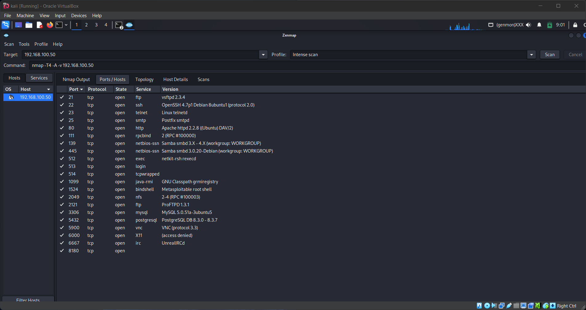
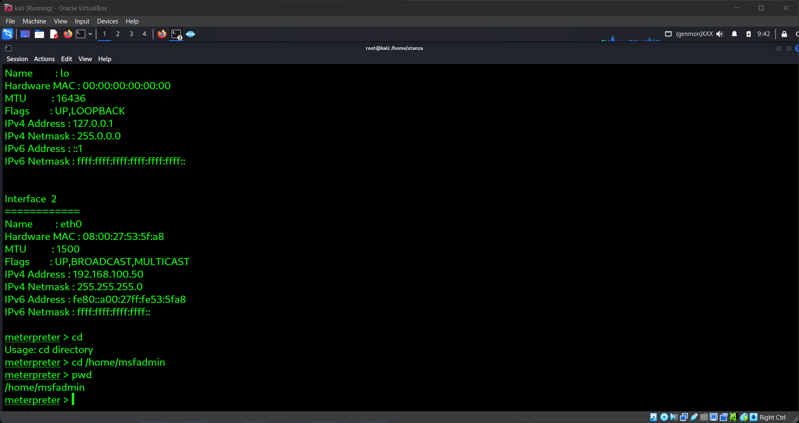

# Project 1: System Hacking – Gaining Access to a Vulnerable Machine

## Objective
Perform ethical exploitation to gain shell access on a vulnerable machine.

## Lab Setup
- Kali Linux (attacker)
- Metasploitable2 (target VM)
- Tools: Nmap, Metasploit Framework

## Steps
1. *Scanning & Enumeration*
   - Ran nmap to discover open ports
   - Found PostgreSQL running on port 5432

2. *Exploitation*
   - Used Metasploit exploit/linux/postgres/postgres_payload
   - Gained shell access as postgres
   - Used configured payload linux/x86/metertpreter/reverse_tcp
 
3. *Post-Exploitation*
   - Navigated to /home/msfadmin
   - Escalated privileges to root
   - Covered tracks by clearing command history

4. *Mitigation Recommendations*
   - Patch PostgreSQL and update regularly
   - Restrict access with firewall rules
   - Disable unnecessary services
   - Enforce least privilege access

## Screenshots

