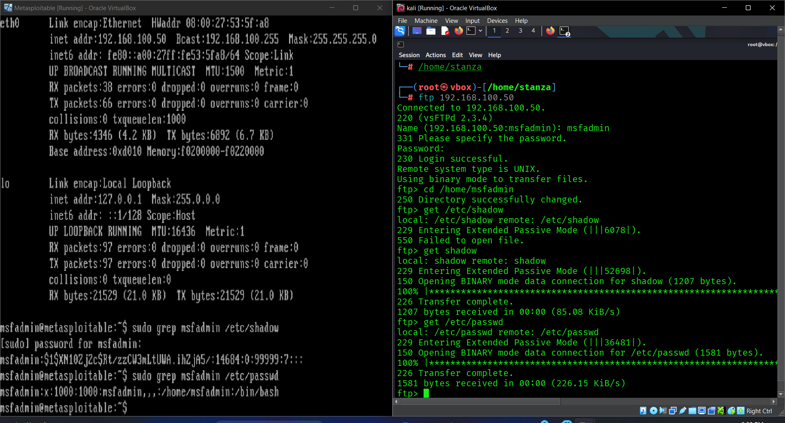
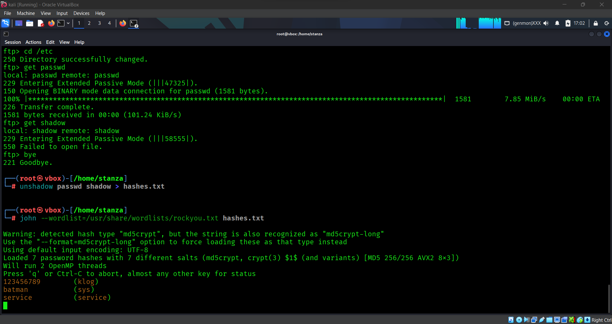

# Password Cracking on Open Source System

## Lab Setup
- Kali Linux (attacker)
- pfSense (firewall)
- Metasploitable2 (target)
- Tools: FTP, John the Ripper

## Steps

### 1. Scanning & Enumeration
- Identified FTP service running on the target.
- Collected user credentials available for testing.

### 2. Exploitation
- Downloaded password hash files through FTP.
- Used *John the Ripper* to perform a dictionary attack.

### 3. Result
- Weak passwords like 1234 were cracked in seconds.
- Demonstrated how insecure password practices expose systems.

### 4. Mitigation Recommendations
- Enforce strong password policies (min length, complexity).
- Enable Multi-Factor Authentication (MFA).
- Regular password rotation.
- Disable anonymous FTP or weak accounts.

## Screenshots
   

