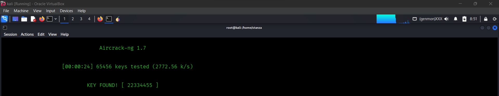

# WiFi Handshake Capture & Crack (Simulated Lab)

**Status:** Completed — simulated / owned AP only  
**Tools used:** Airgeddon, Crunch, Aircrack-ng  
**Adapter:** Atheros USB (monitor + injection capable)  
**Host OS:** Kali Linux (or equivalent)

---

## Objective
Capture WPA2 handshake and recover WiFi password using ethical tools

---

## Important Disclaimer
This repository documents **ethical, lab-only** testing. Do **not** use these techniques on networks or devices you do not own or do not have explicit written permission to test. Do **not** commit `.cap` files or recovered credentials to a public repo.

---

## Prerequisites
- Kali Linux (or similar)
- Atheros USB wireless adapter (supports monitor mode & injection)
- Installed tools:
  - `airgeddon`
  - `crunch`
  - `aircrack-ng`

---

## Steps I performed 

### 1) Start Airgeddon and prepare capture
1. Launch Airgeddon:
  - 'sudo airgeddon'

2. Select your Atheros interface.
- Let Airgeddon put the adapter into monitor mode.
- Scan and select the lab/AP (owned AP).
- Start capturing and wait until Airgeddon shows Handshake captured for <SSID>
- Saved capture file

3. Use Airgeddon’s deauth option to force a client re-auth for handshake capture.

### 2) Crack the capture — Crunch piped to Aircrack-ng (one-liner)
I generated a targeted wordlist with Crunch and piped it directly to Aircrack-ng:
### Example: generate 8–10 char wordlist, pattern: 1 upper, 3 lower, 2 digits
crunch 8 10 ?u?l?l?l?d?d | aircrack-ng -w - -b <AP_BSSID> handshake-01.cap
- Replace <AP_BSSID> with the target BSSID (AP MAC).
- Replace Crunch pattern with the pattern that fits the expected password.

## Mitigation Recommendations
- Upgrade to WPA3 where supported.
- Use long, random passphrases (≥12–16 chars).
= Use WPA2/WPA3-Enterprise (802.1X) for sensitive environments.
= Change default admin credentials and disable remote management.
- Disable legacy protocols (WEP/TKIP).
- Keep router firmware up to date and enable logging/alerts.
- MAC filtering/hidden SSID provide minor obscurity — not a primary defense.

## Safety & Ethics
- Tests performed only on owned equipment or isolated lab AP.
- Always obtain written permission before testing third-party networks.
- Do not publish capture files or recovered credentials. Use a private branch or private repo for instructor-only artifacts.

## References
- Airgeddon project
- Aircrack-ng documentation
- Crunch documentation

## Screenshots

