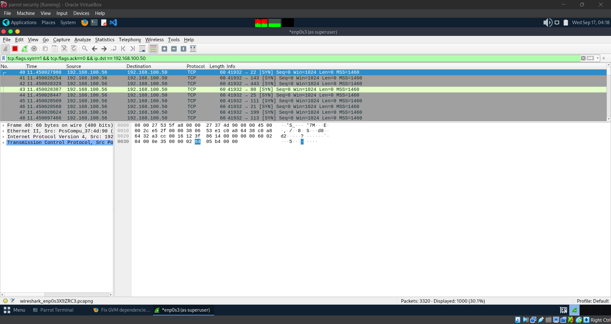
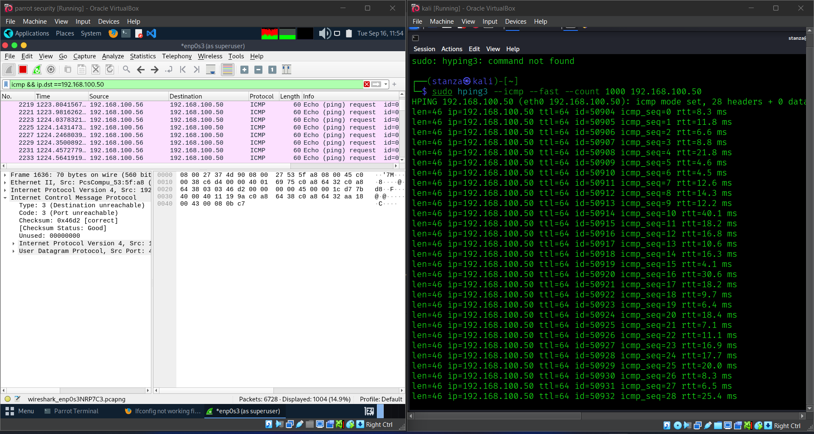
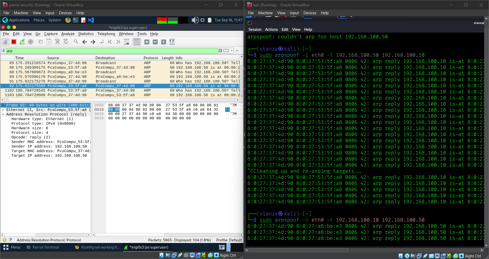

# Network Monitoring & Attack Detection Lab

**Purpose:** capture and identify common network attacks (port scan, ARP spoofing / MITM, DoS-like bursts) using **Wireshark** in an isolated VM lab.

---

## Topology & IPs (lab)
- **Kali (attacker):** `192.168.100.56`  
- **Metasploitable2 (victim):** `192.168.100.50`  
- **Parrot (monitor, Wireshark):** `192.168.100.57`  
- **pfSense (gateway/router):** `192.168.100.10`  

> All VMs run in an **Internal / Host-Only** network. Promiscuous mode enabled on Parrot so it can sniff traffic.
---

## Exact commands 
**Port scan (SYN) — Kali**
```bash
sudo nmap -sS -Pn -p1-500 192.168.100.50
```

**ARP spoofing (MITM) — Kali**  
(Enable forwarding on attacker, then poison victim & gateway)
```bash
sudo sysctl -w net.ipv4.ip_forward=1
sudo arpspoof -i <KALI_IFACE> -t 192.168.100.50 192.168.100.10
sudo arpspoof -i <KALI_IFACE> -t 192.168.100.10 192.168.100.50
# When done: sudo sysctl -w net.ipv4.ip_forward=0
```

**DoS-like (controlled burst) — Kali**  
(Short, isolated bursts only)
```bash
# ICMP burst (controlled)
sudo hping3 --icmp --count 1000 192.168.100.50

# SYN burst (safer low-rate example)
sudo hping3 --syn --rate 200 --count 1000 -p 80 192.168.100.50
```

**Start Wireshark capture — Parrot**
```bash
sudo wireshark
# select the interface with 192.168.100.57 and Start capture
```

---

## Wireshark filters (paste into the display filter bar)
- **SYN scan:**  
  ```
  tcp.flags.syn == 1 && tcp.flags.ack == 0 && ip.dst == 192.168.100.50
  ```
- **ARP frames (ARP spoofing):**  
  ```
  arp
  ```
- **ICMP flood:**  
  ```
  icmp && ip.dst == 192.168.100.50
  ```
- **SYN flood (concentrated):**  
  ```
  tcp.flags.syn == 1 && ip.dst == 192.168.100.50
  ```

---

## Mitigations & recommendations 
- Network segmentation / VLANs — reduce broadcast domain and isolate vulnerable hosts.
- switch hardening — enable port security (sticky MACs), limit max MACs per port.
- Dynamic ARP Inspection (DAI) and DHCP snooping on managed switches.
- Static ARP entries for critical servers where feasible.
- Rate limiting on the edge (pfSense rules) for ICMP and TCP SYN.
- Deploy IDS / monitoring (Zeek for logs; Suricata/Snort for alerts) and tune rules to baseline.
- Operational hygiene — patch vulnerable hosts, restrict admin access, enable MFA, maintain logs and pcap retention policy for incident analysis.

## Screenshots



