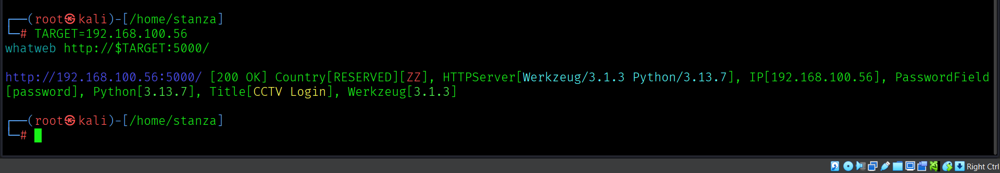
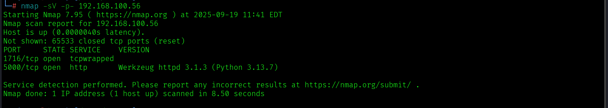
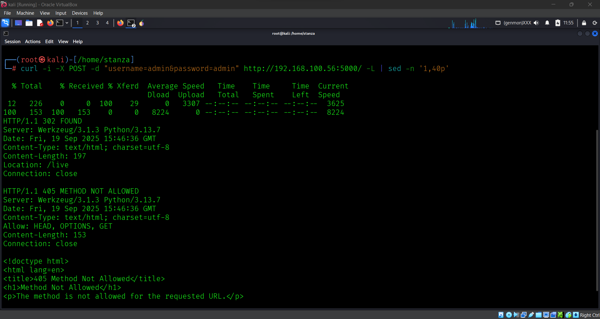
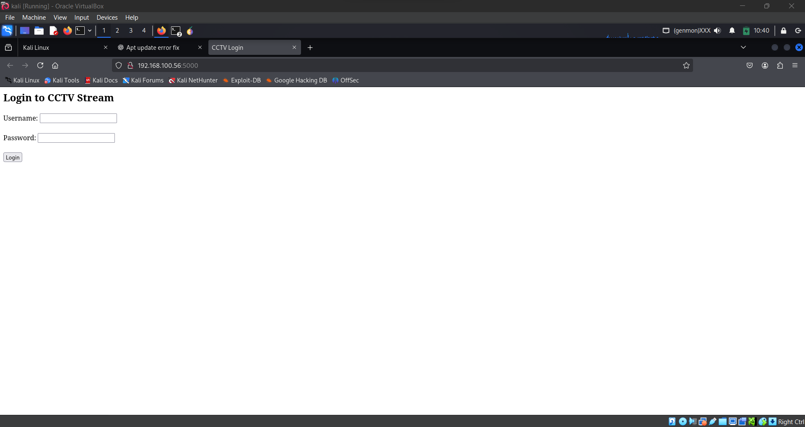
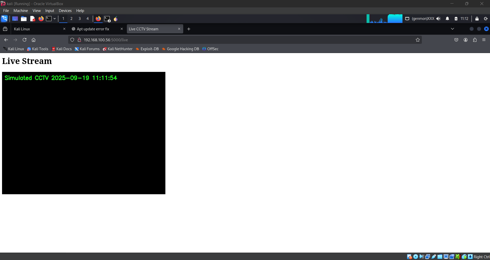

# Simulated CCTV — Lab report (exact steps I performed)

> This document records the exact steps I took in this lab: installing OpenCV, setting up a simulated CCTV, troubleshooting VM webcam issues, scanning, testing default credentials, enumerating web endpoints, and basic mitigation recommendations. Everything below is chronological and verbatim (commands I ran and observed output / behaviour).

---

## Environment
- Host: VirtualBox VM running Kali Linux (guest)
- Project folder: `~/simcctv_lab` (created during the lab)
- Simulated CCTV: Flask-based MJPEG stream (`simulated_cctv.py`)
- Default credentials used for testing: `admin / admin`

---

## 1) System preparation & tools installed
**Commands I ran to prepare the VM and tools:**
- sudo apt update
- sudo apt install -y python3 python3-pip python3-venv cmake g++ wget unzip git \ nmap curl gobuster ffmpeg v4l-utils seclists

---

## 2) Building / installing OpenCV (I built OpenCV from source)

**Commands I used (I built from source, then later used pip wheels as needed):**
 **(download)**
- wget -O opencv.zip https://github.com/opencv/opencv/archive/4.x.zip
- unzip opencv.zip

**build (from inside a build directory)**
- mkdir -p build && cd build
- cmake ../opencv-4.x
- cmake --build .

---

## 3) Python virtual environment & dependencies

**Commands:**
- mkdir -p ~/simcctv_lab
- cd ~/simcctv_lab
- python3 -m venv .venv
- source .venv/bin/activate
- pip install --upgrade pip

**used headless opencv to avoid GUI problems inside VM**
- pip install flask numpy opencv-python-headless
- pip install opencv-python

---

## 4) I created this pyhton script in simulated_cctv.py

- nano simulated_cctv.py
### !/usr/bin/env python3
### simulated_cctv.py
### Simple Flask app that simulates a CCTV MJPEG stream and a login page.
### Default credentials: admin / admin

from flask import Flask, Response, render_template_string, request, redirect, url_for
import cv2
import numpy as np
import time

app = Flask(__name__)

# Default credentials
USERNAME = "admin"
PASSWORD = "admin"

# Frame properties
FRAME_W = 640
FRAME_H = 480
FPS = 10

def generate_frames():
    while True:
        frame = np.zeros((FRAME_H, FRAME_W, 3), dtype=np.uint8)
        ts = time.strftime("%Y-%m-%d %H:%M:%S")
        cv2.putText(frame, f"Simulated CCTV  {ts}", (10, 30),
                    cv2.FONT_HERSHEY_SIMPLEX, 0.7, (0, 255, 0), 2, cv2.LINE_AA)
        ret, buf = cv2.imencode('.jpg', frame)
        if not ret:
            continue
        frame_bytes = buf.tobytes()
        yield (b'--frame\r\n'
               b'Content-Type: image/jpeg\r\n\r\n' + frame_bytes + b'\r\n')
        time.sleep(1.0 / FPS)

LOGIN_PAGE = """
<!doctype html>
<html>
  <head><title>CCTV Login</title></head>
  <body>
    <h2>Login to CCTV Stream</h2>
    <form method="POST" action="/">
      Username: <input type="text" name="username">  
      Password: <input type="password" name="password">  
      <input type="submit" value="Login">
    </form>
    
{{ message }}

  </body>
</html>
"""

STREAM_PAGE = """
<!doctype html>
<html>
  <head><title>Live CCTV Stream</title></head>
  <body>
    <h1>Live Stream</h1>
    
  </body>
</html>
"""

@app.route('/', methods=['GET', 'POST'])
def login():
    message = ""
    if request.method == "POST":
        u = request.form.get("username", "")
        p = request.form.get("password", "")
        if u == USERNAME and p == PASSWORD:
            return redirect(url_for("live"))
        else:
            message = "Invalid credentials!"
    return render_template_string(LOGIN_PAGE, message=message)

@app.route('/live')
def live():
    return render_template_string(STREAM_PAGE)

@app.route('/stream')
def stream():
    return Response(generate_frames(),
                    mimetype='multipart/x-mixed-replace; boundary=frame')

if __name__ == "__main__":
    app.run(host="0.0.0.0", port=5000, debug=False)
PY

## 5) Flask simulated CCTV server (the server I ran)

**I created and ran this file simulated_cctv.py (this is the server I used — it serves /, /live, /stream and uses default admin/admin credentials).** 
**I started it with:**
 * python3 simulated_cctv.py

**Observed terminal output:**
 * Serving Flask app 'simulated_cctv'
 * Running on all addresses (0.0.0.0)
 * Running on http://127.0.0.1:5000
 * Running on http://192.168.100.56:5000
I then opened the browser and confirmed I could reach the login page.

---

## 6) HP Webcam attempt & troubleshooting (what I did)

**What I tried:**
- I attempted to use the host HP integrated webcam via VirtualBox webcam passthrough.
- VirtualBox showed a webcam device and the host camera LED turned on.
- I briefly saw a live stream from the HP camera inside the guest.

**Observed problem:**
- The HP camera feed was unstable and the capture failed after a few seconds (OpenCV reported can't open camera / select() timeout intermittently).
- VirtualBox initially exposed a virtual driver called ManyCam (virtual webcam) which complicated direct access to the HP camera.

**Actions taken:**
- Verified /dev/video* and ran v4l2-ctl --list-devices.
- Attempted to remove ManyCam filter and attach the HP camera in VirtualBox USB/Webcam menu.

Because passthrough remained flaky, I switched to the simulated Flask CCTV stream (stable, reproducible) for the rest of the lab.

---

## 7) Confirming the Flask stream and endpoints (what I did)

I verified the server endpoints existed and the stream worked.

**Check listening and local access:**
- ps aux | grep simulated_cctv | grep -v grep
- sudo ss -ltnp | grep :5000
- curl -v http://127.0.0.1:5000/
- curl -v http://192.168.100.56:5000/

**The stream endpoint is:**
- http://192.168.100.56:5000/stream
- Content-Type: multipart/x-mixed-replace; boundary=frame   # MJPEG

---

## 8) Scanning for open ports (what I ran)

**I ran nmap (full TCP scan) from inside the VM:**
- sudo nmap -sV -p- 192.168.100.56

**Result (what I observed):**
- 5000/tcp open http → Flask server reachable on port 5000

---

## 9) Testing default credentials (exact command I ran)

**I performed a one-shot credential test (curl POST):**
- curl -i -X POST -d "username=admin&password=admin" http://192.168.100.56:5000/ -L | sed -n '1,40p'

**Observed output:**
- HTTP/1.1 302 FOUND
- Location: /live
...
HTTP/1.1 405 METHOD NOT ALLOWED
...
- Interpretation: login succeeded (server redirected to /live), curl then followed the redirect and received 405 on a non-GET; but the important part is the 302 - Location: /live — credentials worked.

I also verified visually in browser that admin/admin logged me into the live page and I could see the timestamped black frame.

---

## 10) Web-based access enumeration (what I ran)

**I enumerated web endpoints and fingerprinted the server:**

**Fingerprint with whatweb:**
- whatweb http://192.168.100.56:5000/
 expected output showed Flask / Werkzeug / Python server

**Find endpoints with gobuster:**
- gobuster dir -u http://192.168.100.56:5000/ -w /usr/share/wordlists/dirb/common.txt -t 20

**Peeked stream headers:**
- curl -I http://192.168.100.56:5000/stream
 Expected: Content-Type: multipart/x-mixed-replace; boundary=frame
- Endpoints found: / (login), /live (UI), /stream (MJPEG)

---

## 11) Final outcome (what I accomplished)

- Started and ran a simulated CCTV server (Flask) on port 5000.
- Scanned and found the open port: 5000/tcp open http.
- Tested and confirmed default creds (admin/admin) — login successful and redirected to /live.
-  Enumerated web endpoints and confirmed /stream is an MJPEG feed.
-Captured a sample frame from the stream with ffmpeg.

## 12) Mitigation recommendations (what I documented)

- Change default credentials immediately.
- Use strong, unique passwords.
- Isolate CCTV systems using network segmentation (VLANs, firewall rules).
- Apply firmware and software updates regularly.
- Serve web interfaces over HTTPS and use authentication tokens for streams.
- Disable unused services and ports; enable logging and monitoring.

## 13) Ethics note

All actions above were performed on a simulated CCTV instance I controlled. Do not use these techniques on systems you do not own or are not explicitly authorized to test.

## Screenshots

