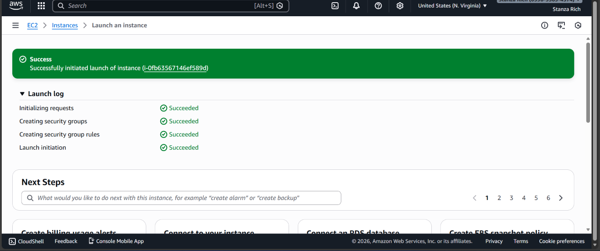
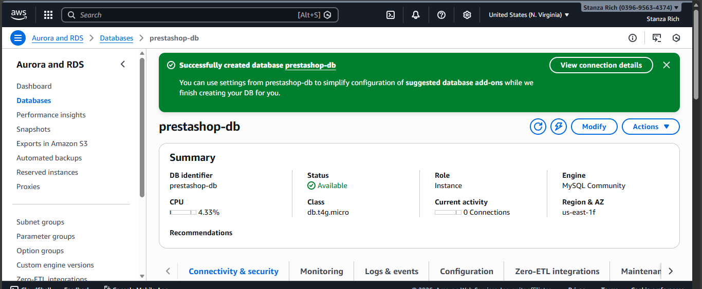
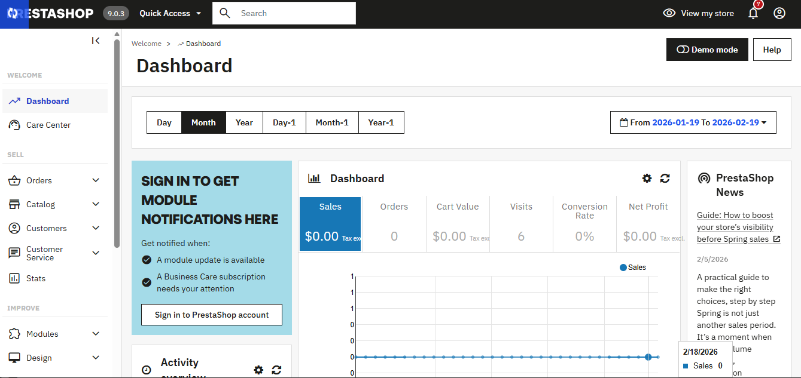
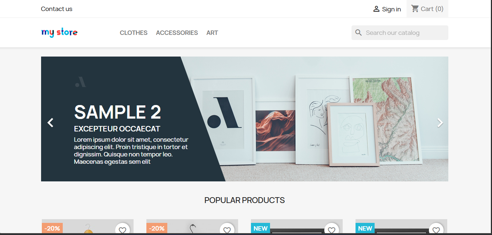
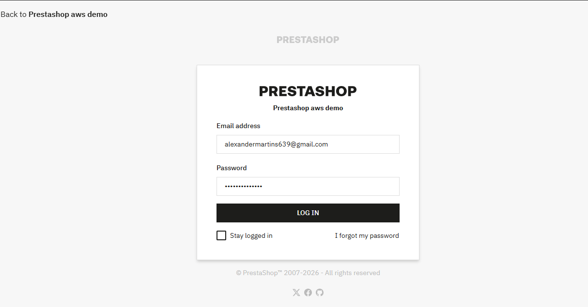
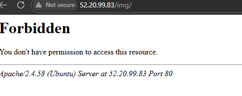
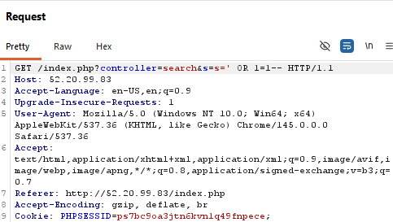
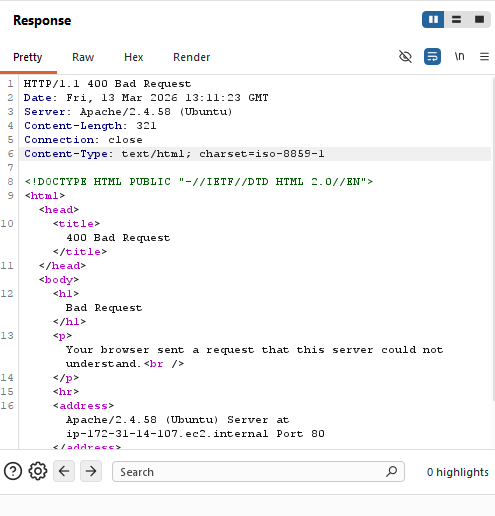
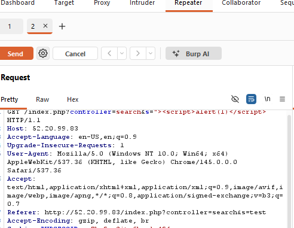
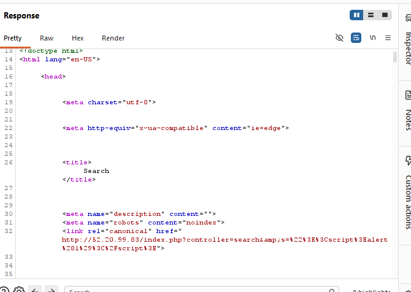

#  PrestaShop Deployment on AWS (EC2 + RDS)

## Live Application
*Public URL:*  
http://52.20.99.83/

---

## Project Overview

This project demonstrates the deployment of an open-source e-commerce platform (PrestaShop) on AWS using a secure architecture.
The web application is hosted on *Amazon EC2, while the database is hosted separately on **Amazon RDS (MySQL)*. The deployment was completed using AWS Free Tier resources.

---

## Architecture Design

```
User
  ↓
Elastic IP
  ↓
EC2 (Ubuntu + Apache + PHP + PrestaShop)
  ↓
Amazon RDS (MySQL Database)
```

### Architecture Summary

- EC2 hosts the web application.
- RDS hosts the database.
- The database is not publicly accessible.
- Security Groups control access between services.

---

## AWS Services Used

- Amazon EC2 (Ubuntu 22.04 – t3.micro)
- Amazon RDS (MySQL – db.t4g.micro)
- VPC
- Security Groups
- Elastic IP
- Apache2
- PHP 8.x

---

## Implementation Steps

### 1 Launch EC2 Instance

- Selected Ubuntu 22.04 LTS
- Instance type: t3.micro (Free Tier)
- Configured Security Group:
  - SSH (22) → My IP only
  - HTTP (80) → 0.0.0.0/0
  - HTTPS (443) → 0.0.0.0/0

---

### 2 Install Apache & PHP

```bash
sudo apt update
sudo apt install apache2 php php-mysql php-gd php-xml php-mbstring unzip php-intl -y
sudo a2enmod rewrite
sudo systemctl restart apache2
```

Updated Apache configuration to allow .htaccess.

---

### 3 Create RDS Database

- Engine: MySQL
- Instance type: db.t4g.micro (Free Tier)
- Public access: *No*
- Created database name and credentials

---

### 4 Configure Security Groups

*EC2 Security Group*
- SSH (22) – My IP
- HTTP (80) – Public access
- MySQL (3306) - EC2 Security Group

*RDS Security Group*
- MySQL (3306) – Source: EC2 Security Group only

This ensures the database can only be accessed from the EC2 instance.

---

### 5 Upload & Install PrestaShop

- Downloaded official production release package
- Uploaded to EC2 via SCP
- Extracted files into `/var/www/html`
- Set proper permissions:

```bash
sudo chown -R www-data:www-data /var/www/html
sudo chmod -R 755 /var/www/html
```

- Accessed installer via browser
- Connected to RDS using database endpoint
- Completed installation successfully

---

### 6 Attach Elastic IP

- Allocated Elastic IP
- Associated it with EC2 instance
- Verified application loads successfully

---

## Security Measures Implemented

- Database hosted on separate RDS instance
- RDS not publicly accessible
- MySQL port restricted to EC2 security group only
- SSH restricted to specific IP
- `/install` directory removed after installation

---

## Challenges Encountered

- Missing PHP extensions during installation
- Apache rewrite configuration issues
```
sudo nano /etc/apache2/apache2.conf
<Directory /var/www/>
Change AllowOverride None → AllowOverride All
```
- Incorrect PrestaShop package downloaded initially
- 404 error after attaching Elastic IP

All issues were resolved through proper troubleshooting and configuration updates.

---

## Screenshots







---

## Conclusion

The PrestaShop application was successfully deployed using AWS Free Tier services with a secure 3-tier architecture separating the application and database layers. This project demonstrates hands-on experience with AWS infrastructure, Linux server configuration, and web application deployment.


---

# PrestaShop Security Assessment & Attack Simulation

## Objective

After deploying the PrestaShop application on AWS, a basic security assessment was performed to evaluate how the application handles common web attacks.

The objective was to simulate real-world attack scenarios and observe how the application and server respond to malicious inputs.

Testing focused on:

- SQL Injection
- Cross-Site Scripting (XSS)

Burp Suite was used to intercept and analyze HTTP traffic between the browser and the server.

---

# Security Configuration Review

Before performing attack simulations, several security checks were performed on the deployed application.

## Administrator Security

- Administrator credentials were configured with a strong password.
- Default credentials were not used after installation.

---

## File Permissions

Application files were assigned proper ownership and permissions.

```bash
sudo chown -R www-data:www-data /var/www/html
sudo chmod -R 755 /var/www/html
```

This ensures the web server has proper access while preventing unauthorized modification.

---

## Directory Listing Disabled

Directory browsing was disabled to prevent attackers from viewing server files through the browser.

Apache configuration:

```apache
Options -Indexes
```

---

## Installation Directory Removed

The PrestaShop installation directory was removed after installation to prevent reinstallation attacks.

```bash
sudo rm -rf /var/www/html/install
```

---

# Attack Simulation

After reviewing the configuration, simulated attacks were performed against the application.

Traffic between the browser and server was intercepted using **Burp Suite** to observe and modify requests.

---

# Directory Exposure Test

## Methodology

A directory exposure test was performed to verify whether sensitive directories on the web server could be accessed directly from the browser.

Attackers often attempt to discover hidden directories in order to locate configuration files, backups, or other sensitive resources.

The test involved attempting to access common directories directly through the browser.

Example attempt:

```
http://52.20.99.83/img/
```

If directory listing is enabled, the server may display all files inside the directory.

---

## Result

The server returned a **403 Forbidden** response when attempting to access the directory.

This indicates that directory listing is disabled and direct browsing of server directories is not permitted.

This protection prevents attackers from viewing internal application files.

---

## Evidence

 

The screenshot shows the server returning a **403 Forbidden** response when attempting to access the directory.


---

# SQL Injection Test

## Methodology

The PrestaShop search functionality was tested for SQL Injection vulnerabilities.

A SQL payload was inserted into the search parameter.

Payload Used:

```http
GET /index.php?controller=search&s=' OR 1=1--
```

This payload attempts to manipulate backend SQL queries by forcing the condition to always return true.

---

## Result

The server returned a **400 Bad Request** response when the malicious request was sent.

This indicates the malformed request was rejected by the web server before it could reach the backend database.

---

## Evidence




The screenshot shows the intercepted request containing the SQL payload and the server response.

---

# Cross-Site Scripting (XSS) Test

## Methodology

An XSS test was performed by injecting a JavaScript payload into the search parameter.

Payload used:

```html
"><script>alert(1)</script>
```

Intercepted request:

```http
GET /index.php?controller=search&s="><script>alert(1)</script>
```

The request was forwarded to the server using Burp Suite.

---

## Result

The application returned the payload encoded inside the HTML response.

Because the payload was encoded instead of executed, the injected JavaScript did not run in the browser.

This behavior indicates that the application performs input sanitization to mitigate reflected XSS attacks.

---

## Evidence






---

# Security Findings

The following observations were made during testing:

- SQL injection attempts were rejected by the server.
- XSS payloads were encoded before rendering in the webpage.
- Input validation mechanisms prevented execution of malicious scripts.

---

# Conclusion

After deployment, the PrestaShop application was tested against common web attack vectors including SQL Injection and Cross-Site Scripting.

The SQL injection attempt resulted in a **400 Bad Request** response, while the XSS payload was properly encoded before rendering in the browser. These results demonstrate that the deployed environment includes basic security mechanisms capable of mitigating common web application attacks.

