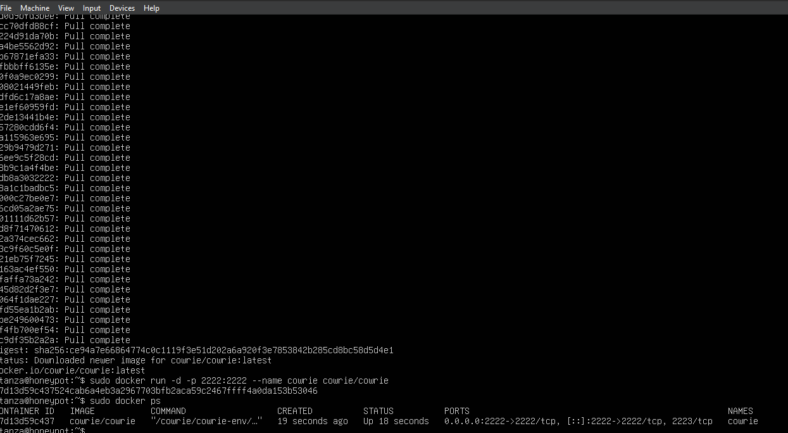

# SSH Brute-Force Attack Analysis Using Cowrie Honeypot

## Executive Summary

This project documents the deployment of a Cowrie SSH honeypot using Docker and the detection of an SSH authentication attack within a controlled lab environment.

The objective was to simulate attacker behavior, capture authentication attempts, analyze network traffic, and produce a structured incident report based on collected evidence.

---

## Environment Overview

| Component | Role |
|-----------|------|
| Kali Linux | Attacker Machine |
| Ubuntu Server | Target System |
| Cowrie (Docker) | SSH Honeypot |
| Wireshark | Packet Analysis |
| Nmap | Reconnaissance |

Network Configuration:
- Target Port: 2222 (SSH Honeypot)
- Protocol: TCP

---

## Honeypot Deployment

Cowrie was deployed inside a Docker container on Ubuntu Server.

```bash
sudo apt install docker.io -y
sudo docker pull cowrie/cowrie
sudo docker run -d -p 2222:2222 --name cowrie cowrie/cowrie
```

The container was verified using:

```bash
sudo docker ps
```

This exposed the SSH honeypot on TCP port 2222.



---

## Attack Simulation

### Reconnaissance

From Kali Linux:

```bash
nmap -A -p 2222 192.168.10.14
```

Result:
- Port 2222 open
- SSH service detected

---

### Authentication Attempt

An SSH connection was initiated:

```bash
ssh root@192.168.10.14 -p 2222
```

Credentials used:

- Username: root
- Password: 567890

---

## Log Analysis

Authentication activity was extracted using:

```bash
sudo docker logs cowrie | grep "login"
```

Observed log entry:

login attempt [b'root'/b'567890'] succeeded

### Key Findings

- Source IP: 192.168.10.12  
- Target IP: 192.168.10.14  
- Target Port: 2222  
- Credential attempt captured  
- Interactive session established  

Cowrie intentionally simulated a successful login to capture attacker behavior, which is expected honeypot functionality.

---

## Network Traffic Analysis

Wireshark was used to capture the attack traffic.

Filter applied:

```
tcp.port == 2222
```

Captured evidence included:

- TCP three-way handshake
- SSH key exchange
- Authentication negotiation

Packet capture file included in repository.

---

# Incident Report

## Incident Type
Unauthorized SSH Authentication Attempt

## Detection Method
Honeypot logging and packet capture analysis

## Timeline
1. Port scan identified open SSH service.
2. SSH connection initiated from attacker machine.
3. Credential attempt logged by honeypot.
4. Session interaction recorded.

## Impact Assessment

No real compromise occurred due to the isolated honeypot environment.

In a production system, similar activity could indicate:
- Brute-force attack
- Credential harvesting attempt
- Unauthorized remote access attempt

## Risk Level
Medium (in real-world scenario)

---

## Mitigation Recommendations

- Disable password-based SSH authentication
- Enforce SSH key-based authentication
- Implement Fail2Ban or IPS controls
- Restrict SSH access via firewall rules
- Continuously monitor authentication logs

---

## Skills Demonstrated

- Docker container deployment
- Honeypot configuration
- Network reconnaissance (Nmap)
- SSH attack simulation
- Log filtering and analysis
- Packet inspection (Wireshark)
- Incident reporting

---

## Conclusion

This project demonstrates the practical detection and analysis of SSH authentication attacks using a Docker-based honeypot. The lab highlights the importance of monitoring exposed services and implementing layered defensive controls in production environments.
